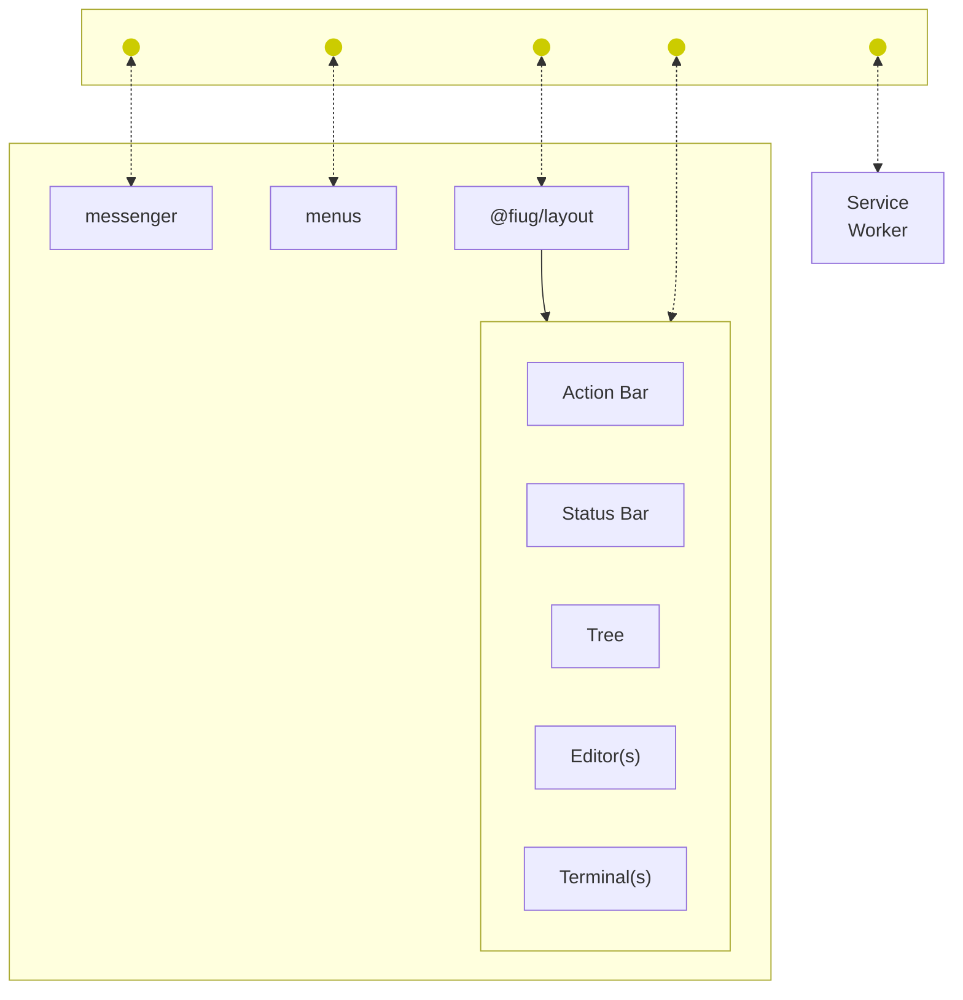

[WIP]

will put notes here about:
- how to test locally
- code of conduct
- pull requests

### FIUG Architecture

```mermaid
flowchart TD
    
    SERVICE_WORKER["Service\nWorker"]
    subgraph BUS[" "]
        MB_F((" ")) 
        MB_S((" "))
        MB_M((" "))
        MB_L((" "))
        MB_MB((" "))
    end
    classDef msg fill:#cc0,stroke-width:0;
    class MB_F,MB_S,MB_M,MB_L,MB_MB msg;

    subgraph FRAMES[" "]
        ACTION_BAR["Action Bar"]
        STATUS_BAR["Status Bar"]
        TREE["Tree"]
        EDITOR["Editor(s)"]
        TERMINAL["Terminal(s)"]
    end

    subgraph MAIN_PAGE[" "]
        MESSAGE_BUS["messenger"]
        MENUS["menus"]
        FRAMES
        LAYOUT["@fiug/layout"]
    end

    LAYOUT -->|" "| FRAMES 

    MB_MB <-.-> MESSAGE_BUS
    MB_M <-.-> MENUS
    MB_L <-.-> LAYOUT
    MB_F <-.-> FRAMES
    MB_S <-.-> SERVICE_WORKER
```